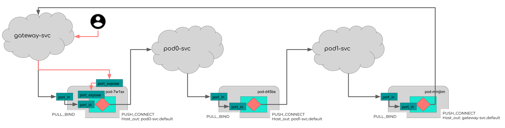

# Creating Flow with Kubernetes

In this example, we build a simple Flow with three Pods (including gateway pod). Here we build a Jina Pod into an image and run it inside containers on kubernetes Pods.




## Prerequisites

- minikube installed
```bash
brew install minikube
```

- kubectl installed
```bash
brew install kubectl
```

## Steps

### 1. Build docker images
Before starting, we need start `minikube` locally and set it to use the local docker registry instead of the remote one.

```bash
minikube start
# use the Docker daemon from Minikube
eval $(minikube docker-env)
```

For demo purpose, we create three docker images for 

```bash
docker build -t pod0 .
docker build -t pod1 .
docker build -t gateway .
```

> Notes: for simplicity, we use the same Dockerfile for all the images.

```Dockerfile
FROM jinaai/jina
ENTRYPOINT ["jina", "pod", "--uses", "_logforward"]
```


### 2. Create ConfigMap

Before creating Pods, we need to creat ConfigMap. We use ConfigMap to pass the port information between different Pods.

```bash
kubectl apply -f k8s/configmap.yml
```

### 3. Create k8s Pods with Deployment

We use `Deployment` to create k8s Pods and this will create Pods together with `ReplicaSet`.

```
kubectl apply -f k8s/deployment_gateway.yaml
kubectl apply -f k8s/deployment_pod0.yaml
kubectl apply -f k8s/deployment_pod1.yaml
```
NAME                                       READY   STATUS    RESTARTS   AGE
jina-gateway-deployment-6479588487-tcznp   1/1     Running   0          27m
jina-pod0-deployment-569cf7d568-hlmq8      1/1     Running   0          27m
jina-pod1-deployment-9f7f849dc-t55xz       1/1     Running   0          27m
After creation, we can check the `ReplicaSet`

```bash
kubectl get replicasets
```

```text
NAME                                 DESIRED   CURRENT   READY   AGE
jina-gateway-deployment-6479588487   1         1         1       24m
jina-pod0-deployment-569cf7d568      1         1         1       24m
jina-pod1-deployment-9f7f849dc       1         1         1       24m
```

Only one Pod is created for each Replica, check the status of the Pods and make sure they are ready before proceeding to the next step.

```bash
kubectl get pods
```

```text
NAME                                       READY   STATUS    RESTARTS   AGE
jina-gateway-deployment-6479588487-tcznp   1/1     Running   0          27m
jina-pod0-deployment-569cf7d568-hlmq8      1/1     Running   0          27m
jina-pod1-deployment-9f7f849dc-t55xz       1/1     Running   0          27m
```


### 4. Make Pods disoverable other Pods 

We need to create Service for each group of Pod so that they are discoverable for other Pods via FQDN.

```bash
kubectl apply -f k8s/service_gateway.yaml
kubectl apply -f k8s/service_pod0.yaml
kubectl apply -f k8s/service_pod1.yaml
```

We can check the status of the services

```bash
kubectl get services
```

```text
NAME               TYPE        CLUSTER-IP      EXTERNAL-IP   PORT(S)                                                           AGE
jina-gateway-svc   NodePort    10.96.122.148   <none>        55558:30528/TCP,55555:30704/TCP,60000:31696/TCP,49000:30123/TCP   36m
jina-pod0-svc      ClusterIP   10.109.161.80   <none>        55555/TCP,55556/TCP,60001/TCP                                     36m
jina-pod1-svc      ClusterIP   10.105.84.25    <none>        55556/TCP,55558/TCP,60002/TCP                                     36m
kubernetes         ClusterIP   10.96.0.1       <none>        443/TCP                                                           40m
```

> Tips: you can check the connectivity of between the Pods using `jina ping`. In the following command, we use `jina-pod0-deployment-569cf7d568-hlmq8` to run `jina ping` against the `jina-pod1-svc` Service.

```bash
kubectl exec jina-pod0-deployment-569cf7d568-hlmq8 -- jina ping jina-pod1-svc 60002
```


### 5. Make Gateway Pod public accessible
So far, all the Pods are internal accessible by service names within the kubenetes cluser. 
In last step, you may notice the configuration of gateway Service is slightly different from the others.
```yaml
...
  - port: 55558
    targetPort: 55558
    name: gateway-port-in
    nodePort: 30528
...
```

`nodePort` field is used to mark the gateway `Service` as `NodePort`-type Service. This will enable the gateway Service public accessible from to the world outside k8s clusters.

We need further tell minikube to expose the NodePort

```bash
minikube service jina-gateway-svc --url
```

```text
http://192.168.64.2:30528
http://192.168.64.2:30704
http://192.168.64.2:31696
http://192.168.64.2:30123
```

> Note the local ip address `http://192.168.64.2:30123` and we will need this for the next step.

We can check the details of the gateway Service

```bash
kubectl describe service jina-gateway-svc
```

```text
Name:                     jina-gateway-svc
Namespace:                default
Labels:                   <none>
Annotations:              Selector:  app=jina-gateway
Type:                     NodePort
IP:                       10.96.122.148
Port:                     gateway-port-in  55558/TCP
TargetPort:               55558/TCP
NodePort:                 gateway-port-in  30528/TCP
Endpoints:                172.17.0.2:55558
Port:                     gateway-port-out  55555/TCP
TargetPort:               55555/TCP
NodePort:                 gateway-port-out  30704/TCP
Endpoints:                172.17.0.2:55555
Port:                     gateway-port-ctrl  60000/TCP
TargetPort:               60000/TCP
NodePort:                 gateway-port-ctrl  31696/TCP
Endpoints:                172.17.0.2:60000
Port:                     gateway-port-expose  49000/TCP
TargetPort:               49000/TCP
NodePort:                 gateway-port-expose  30123/TCP
Endpoints:                172.17.0.2:49000
Session Affinity:         None
External Traffic Policy:  Cluster
Events:                   <none>
```


### 6. Send Requests from local clients.

As we have the Flow running on kubenetes, we can write a simple client and run it on your local machine.

```python
from jina.parsers import set_client_cli_parser
from jina.clients import Client
from jina import Document

def send_index_request(host, port):
    print(f'index request sent to {host}:{port}')
    args = set_client_cli_parser().parse_args(
        ['--host', host, '--port-expose', str(port)])
    grpc_client = Client(args)
    grpc_client.index(
        [Document(text='hello, jina'), ], on_done=print)

def main()
    host_ip = '192.168.64.2'
    flow_port = '30123'
    send_index_request(host_ip, flow_port)
    
if __name__ == '__main__':
    main()
```

As we use `_logforward` in each Pod, we can check the message in the logs of each Pod. 

```bash
kubectl logs jina-pod0-deployment-569cf7d568-hlmq8
```


```text
     ZEDRuntime@10[I]:{
  "requestId": "9e78fc50-57f2-11eb-a860-00e04c6b0562",
  "index": {
    "docs": [
      {
        "id": "a3b058244c06381d",
        "mimeType": "text/plain",
        "text": "hello, jina"
      }
    ]
  }
}
```
