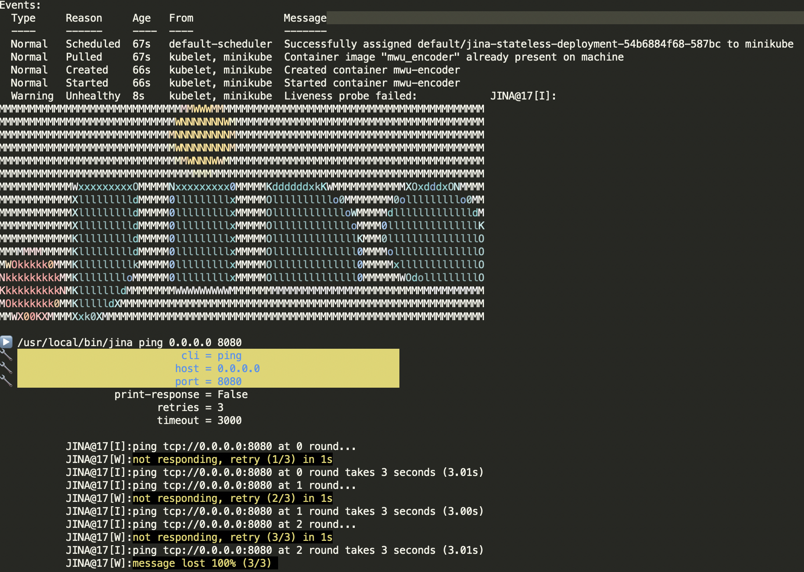

## 🚀 Deploy MWUEncoder

Visualize the flow:


## Steps

**STEP 1**: Start minikube locally:

```python
minikube start
# use the Docker daemon from Minikube
eval $(minikube docker-env)
```

**STEP 2**: Build docker image:

```
docker build -f Dockerfile -t mwu_encoder .
```

**STEP 3**: Deploy to k8s pod:

```
kubectl apply -f k8s/configmap.yaml 
kubectl apply -f k8s/deployment.yaml 
```

It should be noted that we provided a `deployment.yaml` and a `configmap.yaml` in `k8s` folder. `deployment.yaml` specifiy the horizontal scaling capbility with the `replicas` field. Besids, it controls the resource usage and environment variables for the deployment. When applying this deployment, the original entrypoint will be overwritten by the env variables defined in `command`, `args` field and `configmap.yaml`.

**STEP 4**: Check the deployment:

```python
kubectl get pods
>>> "jina-stateless-deployment-[SOME-RANDOMLY-GENERATED-DIGITS-AND-STRINGS]"
kubectl get deployments
>>> "jina-stateless-deployment"
kubectl logs jina-stateless-deployment-[COPY-PASTE-POD-NAME-HERE]
>>> ...
>>> "BasePea@ 9[S]:successfully built MWUEncoder from a yaml config"
>>> "BasePea@ 9[I]:input tcp://0.0.0.0:55555 (PULL_BIND) output tcp://0.0.0.0:55556 (PUSH_BIND) control over tcp://0.0.0.0:48853 (PAIR_BIND)"
>>> "BasePea@ 9[S]:ready and listening"
```

**STEP 5** Health check:

We configured a `livenessProb` in `deployments.yaml`, it calls Jina CLI `jina ping host port` to get the health status of the application, every 30 seconds. To get the health check result, check:

```python
kubectl get pods
>>> "jina-stateless-deployment-[SOME-RANDOMLY-GENERATED-DIGITS-AND-STRINGS]"
kubectl describe pod [YOUR-POD-NAME]
```

In `livenessProb` settings, we managed to ping Jina ctrl port, the `describe pod` command expect to get nothing strange in stdout (indicates health check succeed). If you manually change the health check parameter, e.g. port to a random number, such as 8080, you're expected to get failure message like this:

 


